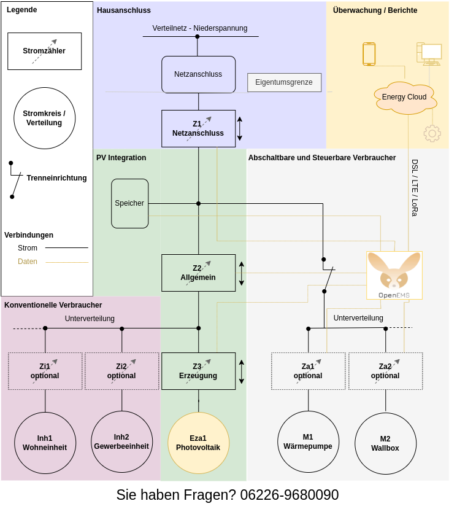

# casa-corrently

Casa-Corrently is an energy monitoring solution design to run from within a local network (home area network). It is designed for the households and businesses in Germany.

## [CONTRIBUTING](https://github.com/energychain/tydids-p2p/blob/main/CONTRIBUTING.md)

## [CODE OF CONDUCT](https://github.com/energychain/tydids-p2p/blob/main/CODE_OF_CONDUCT.md)

## Maintainer / Imprint

<addr>
STROMDAO GmbH   
Gerhard Weiser Ring 29   
69256 Mauer   
Germany   
   
+49 6226 968 009 0   
   
kontakt@stromdao.com   
   
Handelsregister: HRB 728691 (Amtsgericht Mannheim)
</addr>

Project Website: https://tydids.com/

## LICENSE
[Apache-2.0](./LICENSE)
